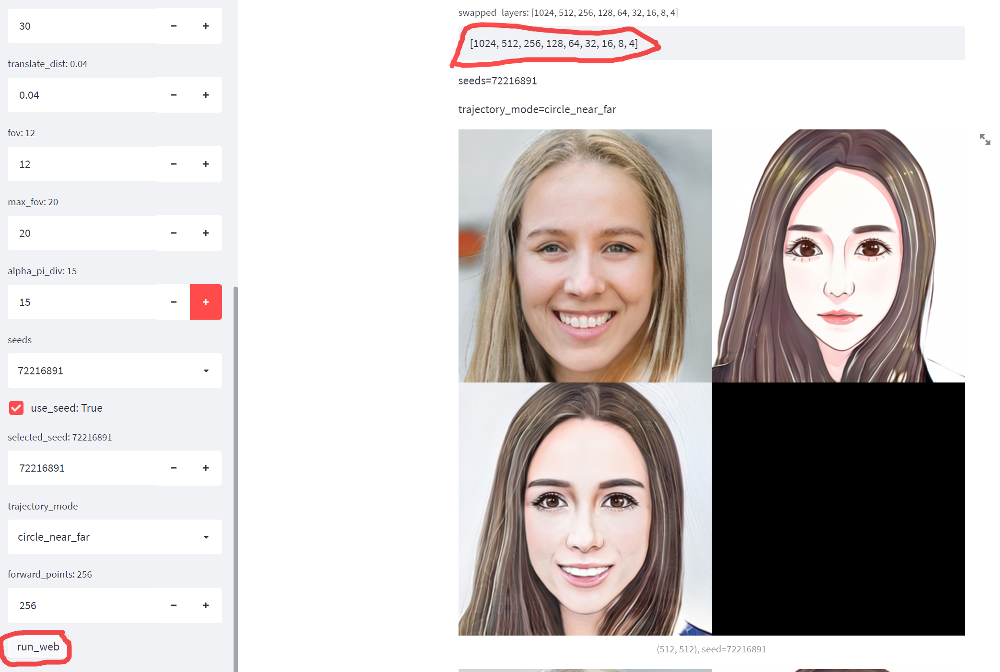
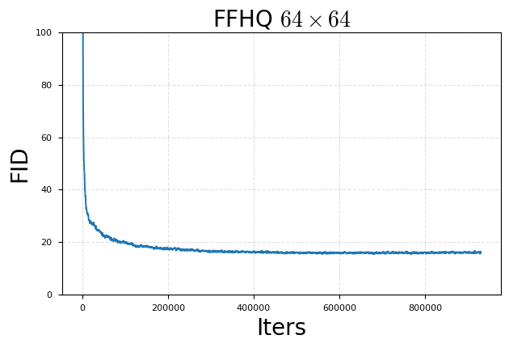

## CIPS-3D

This repository contains the code of the paper, </br > 
[CIPS-3D: A 3D-Aware Generator of GANs Based on Conditionally-Independent Pixel Synthesis](https://arxiv.org/abs/2110.09788).

:heavy_check_mark: (2022-1-5) The code has been refactored. Please refer to the scripts in `exp/cips3d/bash`. Please upgrade the `tl2` package with `pip install -I tl2`.

:heavy_check_mark: (2021-11-26) The configuration files (yaml files) for training are being released.

:heavy_check_mark: (2021-10-27) All the code files have been released. The configuration files (yaml files) for training will be released next. Now I have provided a GUI script and models to facilitate the experiment of network interpolation (see below). If you find any problems, please open an issue. Have fun with it. 


:heavy_check_mark: (2021-10-25) Thank you for your kind attention. The github star has reached two hundred. I will open source the training code in the near future. 

:heavy_check_mark: (2021-10-20)  We are planning to publish the training code here in December. But if the github star reaches two hundred, I will advance the date. Stay tuned :clock10:.


## Demo videos

https://user-images.githubusercontent.com/26176709/137924071-26f700b1-46dc-4c1d-bb2d-189e6cc09116.mp4

https://user-images.githubusercontent.com/26176709/137924277-751c342b-87c0-4539-8ab9-96b795d257ab.mp4

https://user-images.githubusercontent.com/26176709/137924346-dd628c97-64e5-4cf7-9e34-ac6c42a98d3d.mp4

https://user-images.githubusercontent.com/26176709/137924529-c38fa07c-9673-42ab-8a27-8e510d4c65ca.mp4

https://user-images.githubusercontent.com/26176709/137924557-1aa23be9-d079-472e-8a9f-0e08f78fdce8.mp4

https://user-images.githubusercontent.com/26176709/137924581-f5dbf759-1c8c-4dc3-9b85-26f215f0fde0.mp4

<details>
<summary>Mirror symmetry problem</summary>


The problem of mirror symmetry refers to the sudden change of the direction of the bangs near the yaw angle of pi/2. We propose to use an auxiliary discriminator to solve this problem (please see the paper).

Note that in the initial stage of training, the auxiliary discriminator must dominate the generator more than the main discriminator does. Otherwise, if the main discriminator dominates the generator, the mirror symmetry problem will still occur. In practice, progressive training is able to guarantee this. We have trained many times from scratch. Adding an auxiliary discriminator stably solves the mirror symmetry problem. If you find any problems with this idea, please open an issue. 

</details>

<details>
<summary>Prepare environment</summary>

```bash

git clone --recursive https://github.com/PeterouZh/CIPS-3D.git
cd CIPS-3D

# Create virtual environment
conda create -y --name cips3d python=3.6.7
conda activate cips3d

pip install torch==1.8.2+cu102 torchvision==0.9.2+cu102 -f https://download.pytorch.org/whl/lts/1.8/torch_lts.html

pip install --no-cache-dir -r requirements.txt
pip install -I tl2

pip install -e torch_fidelity_lib
pip install -e pytorch_ema_lib

```

</details>

## Model interpolation (web demo) 

Download the pre-trained model [G_ema_ffhq.pth](https://github.com/PeterouZh/CIPS-3D/releases/download/v0.0.1/G_ema_ffhq.pth) 
and [G_ema_cartoon.pth](https://github.com/PeterouZh/CIPS-3D/releases/download/v0.0.1/G_ema_cartoon.pth), and put them in `datasets/pretrained`.

Execute this command:
```bash
streamlit run --server.port 8650 -- scripts/web_demo.py  \
  --outdir results/model_interpolation \
  --cfg_file configs/web_demo.yaml \
  --command model_interpolation

```
Then open the browser: `http://your_ip_address:8650`.

You can debug this script with this command:
```bash
python scripts/web_demo.py  \
  --outdir results/model_interpolation \
  --cfg_file configs/web_demo.yaml \
  --command model_interpolation \
  --debug True

```

<details>
<summary>Prepare dataset</summary>

**FFHQ:** Download FFHQ dataset [images1024x1024](https://github.com/NVlabs/ffhq-dataset) (89.1 GB)
```bash
# Downsampling images in advance to speed up training
python scripts/dataset_tool.py \
    --source=datasets/ffhq/images1024x1024 \
    --dest=datasets/ffhq/downsample_ffhq_256x256.zip \
    --width=256 --height=256
```

**CartoonFaces** Download [photo2cartoon](https://www.kaggle.com/arnaud58/photo2cartoon) dataset
```bash
# Prepare training dataset.
python scripts/dataset_tool.py \
    --source=datasets/photo2cartoon/photo2cartoon \
    --dest=datasets/photo2cartoon/photo2cartoon_stylegan2.zip 
    
```


</details>

## Training 

```bash
Please refer to the scripts in `exp/cips3d/bash`.

```

## Bug fixed

- If the training process is blocked when training with multi GPUs, please upgrade the tl2 via `pip install -I tl2`


<details>
<summary>Old readme</summary>


**Note**: 
- In order to ensure that this code is consistent with my original dirty code, please follow me to reproduce the results using this code step by step. 
- The training script `train_v16.py` is dirty, but I'm not going to refactor it. After all, it still works stably. 

### Start training at 64x64

Training:
```bash
export CUDA_HOME=/usr/local/cuda-10.2/
export CUDA_VISIBLE_DEVICES=0,1,2,3,4,5,6,7
export PYTHONPATH=.
python exp/dev/nerf_inr/scripts/train_v16.py \
    --port 8888 \
    --tl_config_file configs/train_ffhq.yaml \
    --tl_command train_ffhq \
    --tl_outdir results/train_ffhq \
    --tl_opts curriculum.new_attrs.image_list_file datasets/ffhq/images256x256_image_list.txt \
      D_first_layer_warmup True

```

Dummy training (for debug):
```bash
export CUDA_HOME=/usr/local/cuda-10.2/
export CUDA_VISIBLE_DEVICES=1
python exp/dev/nerf_inr/scripts/train_v16.py \
    --port 8888 \ 
    --tl_config_file configs/train_ffhq.yaml \
    --tl_command train_ffhq \
    --tl_outdir results/train_ffhq_debug \ 
    --tl_debug \
    --tl_opts curriculum.new_attrs.image_list_file datasets/ffhq/images256x256_image_list.txt \
      num_workers 0 num_images_real_eval 10 num_images_gen_eval 2 

```

When the FID of the 64x64 model reaches about 16, we start the next step: resume training at 128x128. 
Let's wait for the training (about 2 days or less). 

Reproduced results: best_FID=15.27




### Resume training at 128x128 from the 64x64 models

Training:
```bash
export CUDA_VISIBLE_DEVICES=0,1,2,3,4,5,6,7
export PYTHONPATH=.
python exp/dev/nerf_inr/scripts/train_v16.py \
    --port 8888 \
    --tl_config_file configs/train_ffhq.yaml \
    --tl_command train_ffhq_r128 \
    --tl_outdir results/train_ffhq \
    --tl_resume \
    --tl_resumedir results/train_ffhq \
    --tl_opts curriculum.new_attrs.image_list_file datasets/ffhq/images256x256_image_list.txt \
      D_first_layer_warmup True reset_best_fid True update_aux_every 16 d_reg_every 1 train_aux_img True

```

Dummy training (for debug):
```bash
export CUDA_HOME=/usr/local/cuda-10.2/
export CUDA_VISIBLE_DEVICES=1
python exp/dev/nerf_inr/scripts/train_v16.py \
    --port 8888 \ 
    --tl_config_file configs/train_ffhq.yaml \
    --tl_command train_ffhq_r128 \
    --tl_outdir results/train_ffhq \ 
    --tl_resume \
    --tl_resumedir results/train_ffhq \
    --tl_debug \
    --tl_opts curriculum.new_attrs.image_list_file datasets/ffhq/images256x256_image_list.txt \
      num_workers 0 num_images_real_eval 10 num_images_gen_eval 2 reset_best_fid True

```

When the FID of the 128x128 model reaches about 16, we start the next step.

Some hyperparameters may be different from the original experiment. Hope it works normally. 
Let's wait for the training (maybe longer). 


### Resume training at 256x256 from the 128x128 models

```bash

```

## Finetune INR Net

```bash

```

</details>

## Citation

If you find our work useful in your research, please cite:
```

@article{zhou2021CIPS3D,
  title = {{{CIPS}}-{{3D}}: A {{3D}}-{{Aware Generator}} of {{GANs Based}} on {{Conditionally}}-{{Independent Pixel Synthesis}}},
  shorttitle = {{{CIPS}}-{{3D}}},
  author = {Zhou, Peng and Xie, Lingxi and Ni, Bingbing and Tian, Qi},
  year = {2021},
  eprint = {2110.09788},
  eprinttype = {arxiv},
}

```

## Acknowledgments

- pi-GAN from [https://github.com/marcoamonteiro/pi-GAN](https://github.com/marcoamonteiro/pi-GAN)
- CIPS from [https://github.com/saic-mdal/CIPS](https://github.com/saic-mdal/CIPS)
- StyleGAN2 from [https://github.com/rosinality/stylegan2-pytorch](https://github.com/rosinality/stylegan2-pytorch)
- torch-fidelity from [https://github.com/toshas/torch-fidelity](https://github.com/toshas/torch-fidelity)
- StudioGAN from [https://github.com/POSTECH-CVLab/PyTorch-StudioGAN](https://github.com/POSTECH-CVLab/PyTorch-StudioGAN)
- DiffAug from [https://github.com/mit-han-lab/data-efficient-gans](https://github.com/mit-han-lab/data-efficient-gans)
- stylegan2-ada from [https://github.com/NVlabs/stylegan2-ada-pytorch](https://github.com/NVlabs/stylegan2-ada-pytorch)
